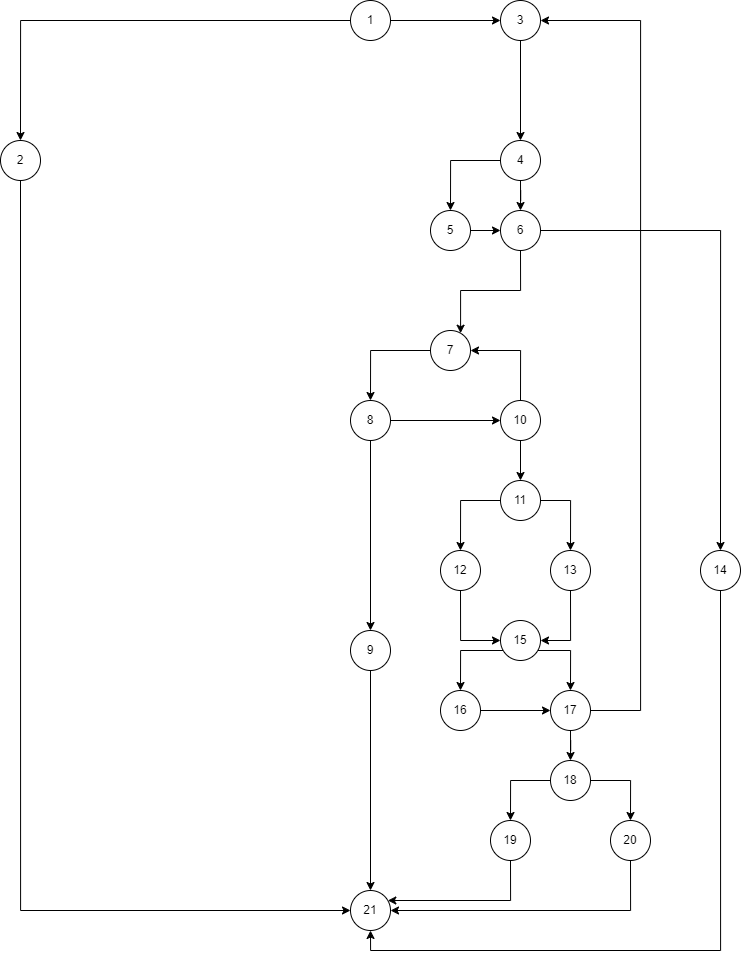

# Втора лаораториска вежба по Софтверско инженерство

## Кристина Каранфилова 213115

### Control Flow Graph

### Цикломатска комплексност
Ја искористив формулата P+1, каде што P е бројот на предикатни јазли. Во случајoв P=9, па цикломатската комплексност изнесува 10.

### Every Branch

Test 1: AllItems = `null` and Payment = ANY -> throws Exception  
Test 2: AllItems = `[];` and Payment = 0; -> returns True : Бидејќи е празна листата тоа значи дека sum ке биде 0 : sum <= 0  
Test 3: AllItems = `[];` and Payment = -1; -> returns False : Бидејќи е празна листата тоа значи дека sum ке биде 0 : sum <= -1  
Test 4: AllItems = `[{name = "", barcode = null, price = "40", discount = 0}];` and Payment = ANY -> throws Exception  
Test 5: AllItems = `[{name = "", barcode = "012345", price = "300", discount = 0.5}];` and Payment = 150 -> returns True : 150 <= 150  
Test 6: AllItems = `[{name = "", barcode = "012345", price = "300", discount = 0.5}];` and Payment = 100 -> returns False : 150 <= 100  
Test 7: AllItems = `[{name = "Name", barcode = "ABC123", price = "127", discount = 0}];` and Payment = ANY -> throws Exception  
Test 8: AllItems = `[{name = "Name", barcode = "098765", price = "30", discount = -1}];` and Payment = 30 -> returns True : 30 <= 30 : Попустот не се брои дека е помал од 0  
Test 9: AllItems = `[{name = "Name", barcode = "098765", price = "30", discount = -1}];` and Payment = 10 -> returns False : 30 <= 10 : Попустот не се брои дека е помал од 0  

### Multiple Condition
Test 1: AllItems = `price = 500, discount = 1, barcode = "0"` and Payment = 460 -> returns False : 500 <= 460  
Test 2: AllItems = `price = 600, discount = 1, barcode = "0"` and Payment = 500 -> returns False : 500 <= 600  
Test 3: AllItems = `price = 500, discount = 0, barcode = "0"` and Payment = 500 -> returns True : 500 <= 500  
Test 4: AllItems = `price = 500, discount = 1, barcode = "1"` and Payment = 500 -> returns True : 500 <= 500  